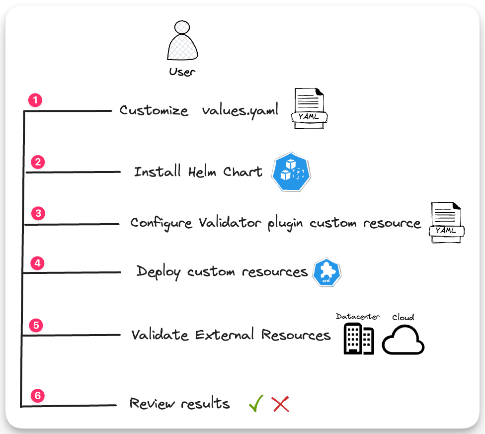

# Install Validator

This install guide will help you install the Validator and get started using one the plugins. Validator supports multiple plugins and each plugin may require a set of configuration parameters. This guide uses the AWS plugin and shows you how to configure it. Use this guide as a starting point for installing Validator and its plugins.


## Prerequisites

- An AWS account.

- AWS credentials with [AdministratorAccess](https://docs.aws.amazon.com/aws-managed-policy/latest/reference/AdministratorAccess.html) policy attached. You can create a new user with this policy and use the credentials with the AWS plguin. Refer to the [AWS IAM User](https://docs.aws.amazon.com/IAM/latest/UserGuide/id_users_create.html) documentation for more details.

> [!IMPORTANT]
> You can use a different policy, but ensure that the policy has the permissions required to check the resources needed by the plugin. Refer to the AWS plugin documentation for more details.

- [wget](https://www.gnu.org/software/wget/) or a similar tool installed on your machine.

- A text editor.

- [kubectl](https://kubernetes.io/docs/tasks/tools/install-kubectl/) installed on your machine.

- [helm](https://helm.sh/docs/intro/install/) installed on your machine.

- [kind](https://kind.sigs.k8s.io/docs/user/quick-start/) installed on your machine.

> [!NOTE]
> If you already have a Kubernetes cluster, you can skip the kind installation and use your existing cluster. Ensure you have access to the cluster.

## Overview

The following diagram displays at a high-level the steps you will complete. You will install Validator in a Kubernetes cluster, configure a plugin, deploy a validation plugin's custom resource, and review the results.




## Install Validator

Create a Kubernetes cluster using kind. If you already have a cluster, you can skip this step.


```shell
kind create cluster --name validator
```


Validate that the cluster is available and that you have access to it. Use the following command to get the cluster information.

```
kubectl cluster-info
```

Example output:
```
Kubernetes control plane is running at https://127.0.0.1:49470
CoreDNS is running at https://127.0.0.1:49470/api/v1/namespaces/kube-system/services/kube-dns:dns/proxy

To further debug and diagnose cluster problems, use 'kubectl cluster-info dump'.
```

Add the Validator Helm repository and update the local Helm cache.

```shell
helm repo add validator https://spectrocloud-labs.github.io/validator/ && \
helm repo update
```

Create a **values.yaml** containing the Validator configuration. Use the command below to download the default **values.yaml** file.

```shell
wget https://raw.githubusercontent.com/spectrocloud-labs/validator/main/chart/validator/values.yaml
```

Before you install Validator, you can configure the installation by editing the `values.yaml` file. The `values.yaml` file contains the default configuration for Validator. You can override the default configuration by editing the `values.yaml` file.


Each plugin has a set of configuration parameters, and each plugin may require a set of credentials. Use a text editor to edit the **values.yaml** file and navigate down to the `plugins.chart` section and locate the `validator-plugin-aws` configuration values. 

Remove the `{}` from the `secret`parameter and uncomment the `secretName` parameter. Use the default value of `aws-creds` for the `secretName` parameter. The auth section should look like the following. 

> [!WARNING]
> If you are not using a kind cluster, review the options in the comments and select the option that matches your environment.


```yaml
auth:
    # Option 1: Leave secret undefined for implicit auth (node instance role, IMDSv2, etc.)
    # Option 2: Create a secret via pluginSecrets (see below). Note: secretName and pluginSecrets.aws.secretName match.
    # Option 3: Specify the name of a preexisting secret in your target cluster and leave pluginSecrets.aws undefined.
    #
  secret: 
    secretName: aws-creds
```

> [!NOTE]
> The `secretName` parameter specifies the name of the secret that contains the AWS credentials. The AWS plugin requires credentials to access your AWS account. Depending on where your cluster is hosted, you may have to provide credentials. In this example, because Validator is installed in a kind cluster, you must provide credentials. If you are deploying Validator to a Kubernetes cluster in AWS, you can use the node instance role or IMDSv2. Refer to the AWS plugin documentation for more details.

Next navigate down to the `pluginSecrets` section and locate the `aws` authentication section. 
The AWS plugin requires credentials to access your AWS account. Uncomment the `aws` section and add your AWS credentials. By default the `aws` section contains a an empty `{}` block. Replace the empty block with the following configuration. Replace the `accessKeyId` and `secretAccessKey` with your AWS credentials. 

```yaml
pluginSecrets:
  # If installing the AWS plugin, the below config is required unless one of the following applies:
  # - The target cluster already contains a secret with the correct format and you've specified its name above.
  #   If specifying your own secret, refer to chart/validator/templates/plugin-secret-aws.yaml for
  #   an example of the expected format and ensure that it exists in the same namespace as the Helm release.
  # - You're deploying to a K8s cluster in AWS and relying on an node instance IAM role
  # - You're deploying to a K8s cluster in AWS and relying on IMDSv2, plus you've specified auth.serviceAccountName
  #
  aws: 
    secretName: aws-creds  # ensure this matches the AWS plugin values above
    accessKeyId: "***************"
    secretAccessKey: "*****************"
    sessionToken: ""

  # If installing the vSphere plugin, the below config is required unless the following applies:
  # - the target cluster already has a secret with the correct format and you've specified its name above
  vSphere: {}
    # secretName: vsphere-creds  # ensure this matches the vSphere plugin values above
    # username: ""
    # password: ""
    # vcenterServer: ""
    # insecureSkipVerify: ""
```

Now that you have configured the AWS plugin, you can install Validator. Use the following command to install Validator and the AWS plugin.

```shell
helm install validator validator/validator --values values.yaml --namespace validator --create-namespace
```

Validate that the Validator pods and the AWS plugin pods are available. Use the following command to get the status of the pods.

```shell
kubectl get pods --namespace validator
```


```shell
NAME                                                           READY   STATUS    RESTARTS   AGE
validator-controller-manager-65f4fc8698-cd7kw                  2/2     Running   0          51s
validator-plugin-aws-controller-manager-d679f59df-9pfsh        2/2     Running   0          39s
validator-plugin-network-controller-manager-5bf4f45968-8tp7h   2/2     Running   0          32s
validator-plugin-vsphere-controller-manager-5fbff8488d-6v2nb   2/2     Running   0          36s
```

Now that you have Validator installed, you can create a validation. A validation is a custom resource that contains the configuration for the validation. Validator will create a `ValidationResult` custom resource that contains the result of the validation.

## Create a Validation

The next step is to create a validation configuration. Each plugin contains a set of example validation configurations. You can use the example configurations as a starting point for your validation. For this guide, you will use the [`awsvalidator-spectro-cloud-base`](https://github.com/spectrocloud-labs/validator-plugin-aws/blob/main/config/samples/awsvalidator-iam-role-spectro-cloud-base.yaml) configuration. 

> [!NOTE]
> Check out the AWS [config samples](https://github.com/spectrocloud-labs/validator-plugin-aws/tree/main/config/samples) directory for more examples.


Create a file named `validation.yaml` and copy the contents of the [`awsvalidator-spectro-cloud-base`](https://github.com/spectrocloud-labs/validator-plugin-aws/blob/main/config/samples/awsvalidator-iam-role-spectro-cloud-base.yaml) Use the following command to download the file and save it as `validation.yaml`.

```shell
wget https://raw.githubusercontent.com/spectrocloud-labs/validator-plugin-aws/main/config/samples/awsvalidator-iam-role-spectro-cloud-base.yaml --output-document validation.yaml
```

Review the contents of the `validation.yaml` file. The `spec` section contains the configuration for the validation.  Change the `spec` section to match your requirements. For example, you can change the `defaultRegion` to match your prefered AWS region. 


```yaml
apiVersion: validation.spectrocloud.labs/v1alpha1
kind: AwsValidator
metadata:
  name: awsvalidator-spectro-cloud-base
spec:
  auth: {}
  defaultRegion: us-west-1
  iamRoleRules:
  - iamPolicies:
    - name: Controllers Policy
      statements:
      - actions:
      # Remainder of the file omitted for brevity
```


Now that you have the validation configuration, you can create the validation. Use the following command to create the validation.

```shell
kubectl apply --filename validation.yaml
```

You can verify the Custom Resource (CR) for the AWS plugin was created by using the following command. 

```shell
kubectl get crd
```

```shell
NAME                                             CREATED AT
awsvalidators.validation.spectrocloud.labs       2023-11-21T00:54:00Z
networkvalidators.validation.spectrocloud.labs   2023-11-21T00:54:08Z
validationresults.validation.spectrocloud.labs   2023-11-21T00:53:51Z
validatorconfigs.validation.spectrocloud.labs    2023-11-21T00:53:51Z
vspherevalidators.validation.spectrocloud.labs   2023-11-21T00:54:04Z
```

Review the result of the validation by using the following command.

```shell
kubectl describe validationresults
```

```shell
Name:         validator-plugin-aws-awsvalidator-spectro-cloud-base
Namespace:    default
Labels:       <none>
Annotations:  validator/validation-result-hash: 2IjYPs4C+8fu6MnuBq09lg==
API Version:  validation.spectrocloud.labs/v1alpha1
Kind:         ValidationResult
Metadata:
  Creation Timestamp:  2023-11-15T17:22:33Z
  Generation:          1
  Resource Version:    141250
  UID:                 18d37dd9-9e4a-4397-b857-03116cf62975
Spec:
  Expected Results:  1
  Plugin:            AWS
Status:
  Conditions:
    Failures:
      v1alpha1.IamRoleRule SpectroCloudRole missing action(s): [s3:PutObject s3:DeleteObject s3:PutBucketOwnershipControls s3:PutBucketPolicy s3:PutBucketPublicAccessBlock s3:PutObjectAcl] for resource arn:*:s3:::* from policy Controllers Policy
    Last Validation Time:  2023-11-15T17:26:37Z
    Message:               One or more required IAM permissions was not found, or a condition was not met
    Status:                False
    Validation Rule:       validation-SpectroCloudRole
    Validation Type:       aws-iam-role-policy
  Sink State:              N/A
  State:                   Failed
Events:                    <none>
```

If the validation fails, you can review the `Failures` section of each `Condition`  to determine the cause of the failure. In this example, the IAM policy is missing a set of required permissions. 


The Validator will continouslly re-issue a validation and update the `ValidationResult` CR with the result of the validation. You can use the following command to get the status of the validation. Once you addressed the cause of the failure, the validation will pass.


If you encountered an error and fixed the error, after about 30 seconds check the validation results again. In this example, the IAM policy was updated to add the missing permissions. 


```shell
kubectl describe validationresults
```

```shell
Name:         validator-plugin-aws-awsvalidator-spectro-cloud-base
Namespace:    default
Labels:       <none>
Annotations:  validator/validation-result-hash: 2A5jQj0W4SBN8IKGC0zRbQ==
API Version:  validation.spectrocloud.labs/v1alpha1
Kind:         ValidationResult
Metadata:
  Creation Timestamp:  2023-11-15T17:43:11Z
  Generation:          1
  Resource Version:    1937
  UID:                 876b29bd-8d96-47f4-8d0c-c4d6eeae039c
Spec:
  Expected Results:  1
  Plugin:            AWS
Status:
  Conditions:
    Last Validation Time:  2023-11-15T17:53:21Z
    Message:               All required aws-iam-role-policy permissions were found
    Status:                True
    Validation Rule:       validation-SpectroCloudRole
    Validation Type:       aws-iam-role-policy
  Sink State:              N/A
  State:                   Succeeded
Events:                    <none>
```


The validation results are hashed and result events are only emitted if the result has changed. In this example, the validation check was successful and the `ValidationResult` CR was updated with the result of the validation.


> [!NOTE]
> You can receive validator results by enabling Sinks. For example, if you enable the Slack sink, you will receive a Slack notification when a validation fails or succeeds. Refer to the [Sinks](../README.md#sinks) section for more details.


## Cleanup

To delete the Validator installation, use the following command. This command deletes the Validator and all deployed resources including the `ValidationResult` CRs.

```shell
helm uninstall validator --namespace validator
```

Next, delete the namespace.

```shell

kubectl delete namespace validator
```


If you deployed a kind cluster, use the following command to delete the cluster.

```shell
kind delete clusters validator
```


## Next Steps

In this guide you learned how to install Validator and configure one of the plugins. You also learned how to create a validation and review the results. Use the knowledge you gained in this guide to configure the other plugins and create your own validations.

We encourage you to explore the other plugins and create your own validations as you gain more experience with Validator.

## Additional Resources


Below are links to the documentation for the other plugins.

- [AWS](https://github.com/spectrocloud-labs/validator-plugin-aws)
- [Azure](https://github.com/spectrocloud-labs/validator-plugin-azure)
- [Network](https://github.com/spectrocloud-labs/validator-plugin-network)
- [OCI](https://github.com/spectrocloud-labs/validator-plugin-oci)
- [vSphere](https://github.com/spectrocloud-labs/validator-plugin-vsphere)